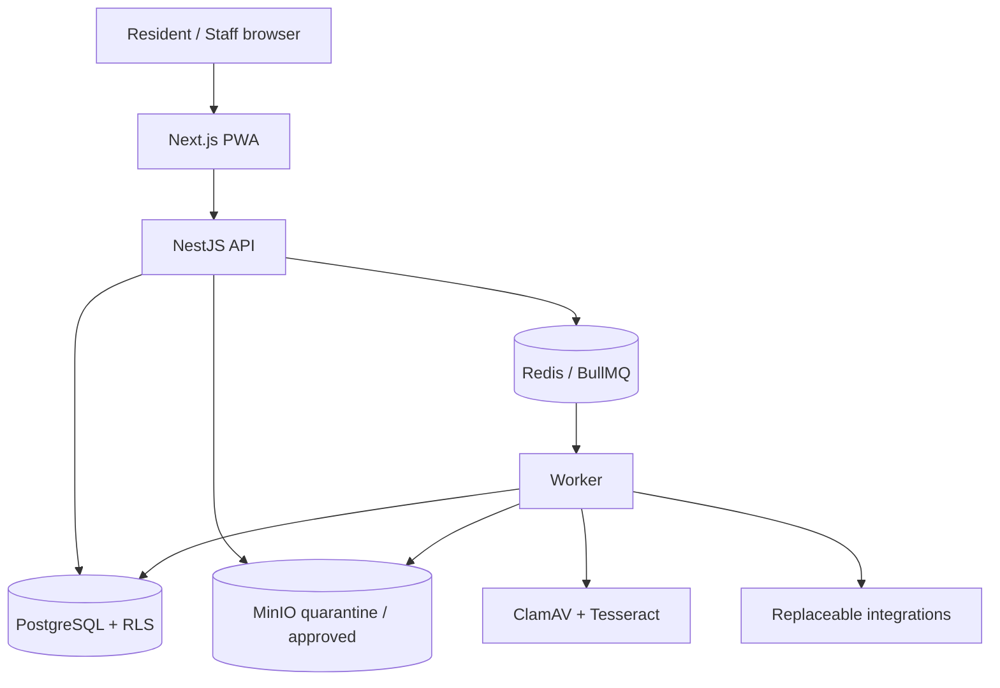

# Architecture

## Style

BlocTrust begins as a modular monolith in one repository. The API owns authorization and state transitions; the worker executes durable background operations; PostgreSQL remains the source of truth.

## Trust boundaries

1. Browser to web/API: hostile input; cookies, CSRF, Origin, validation, and rate limits apply.
2. API to data stores: application authorization plus transaction-scoped organization context and RLS.
3. Quarantine to approved storage: only the scanning worker may promote a verified object.
4. Queue delivery: at-least-once delivery; every handler requires a deterministic idempotency key.
5. External integrations: untrusted and replaceable; signatures, time windows, minimal payloads, and fallbacks apply.

## Module ownership

NestJS modules own their controllers, application use cases, policies, repository interfaces, events, and tests. Initial boundaries are identity, organizations, memberships, buildings, vendors, contracts, documents, invoices, approvals, risk, incidents, work-orders, meters, chat, polls, workflows, notifications, audit, and observability.

Direct cross-module database manipulation is prohibited. Cross-module behavior uses a published use case or a versioned domain event.

## Command and event flow

1. The API authenticates the session and loads server-side membership.
2. A policy authorizes the exact resource and current state.
3. One transaction writes domain state and an `OutboxEvent`.
4. A relay claims unpublished events and enqueues a deterministic BullMQ job.
5. An idempotent worker records attempts and produces the outcome.
6. Clients read durable state and may receive a real-time progress hint.

## Repository structure

| Path              | Responsibility                                                 |
| ----------------- | -------------------------------------------------------------- |
| `apps/web`        | Next.js resident and administrator UI.                         |
| `apps/api`        | NestJS REST API and future realtime gateway.                   |
| `apps/worker`     | BullMQ processors, outbox relay, and schedules.                |
| `packages/domain` | Framework-neutral types, events, policies, and state machines. |
| `packages/ui`     | Accessible shared components.                                  |
| `packages/config` | Shared tool configuration.                                     |
| `prisma`          | Schema, migrations, and synthetic seed data.                   |
| `compose.yaml`    | Local container and operations configuration.                  |
| `tests/security`  | Attack-oriented regression tests.                              |

## Critical invariants

- Every tenant-owned record carries `organizationId` and is authorized through a membership.
- High-risk invoices require two distinct eligible users and valid approval-version state.
- Bank-account changes create immutable history; prior values are never overwritten.
- OCR creates suggestions only and cannot approve financial data.
- Published decision snapshots and audit events are append-only.
- External events and jobs are idempotent under replay.

## Identity and tenant request path

1. The access cookie carries only signed identity, session, organization, and expiry identifiers.
2. The API loads the active session, user status, and membership role from PostgreSQL; it never
   accepts a role or step-up timestamp from the client.
3. Route policy verifies the server-loaded membership and requested organization identifier.
4. Tenant repositories start a transaction, assume the non-login `bloctrust_app` role, and set
   `app.organization_id` locally.
5. PostgreSQL RLS filters reads and blocks writes outside that organization, even if a repository
   query omits its tenant predicate.

System-scoped identity queries use the migration owner connection only inside the identity module.
Tenant-owned reads and writes must use `TenantDatabaseService.run`.

## CRM relationship and evidence boundary

Buildings, apartments, occupancies, membership grants, vendors, contracts, bank evidence, and
audit events all carry `organizationId`. Relations between tenant resources use composite foreign
keys `(id, organizationId)` in addition to RLS, preventing cross-tenant graph edges at the database
constraint layer.

The CRM module owns building authorization, Vendor Trust Passports, contracts, cursor search,
optimistic writes, dashboards, and redacted audit writes. Full bank fields cross a separate
application-encryption boundary and never enter the default serialization shape. See ADR-009.
